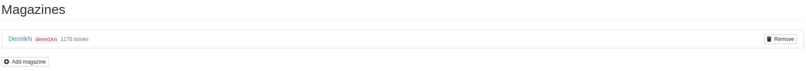

# CRM Issues Module

## Configuration

### Directory

Default directory for issues, is APP_ROOT/content/issues. Directory is created automatically with first upload.

You can use other buckets for uploads, but you need to define them in your config file `app/config/config.neon`:

```neon
services:	
	# ...
	# fileManager extension - example uploads
	exampleIssuesFileSystem: League\Flysystem\Filesystem(League\Flysystem\Adapter\Local('%appDir%/../content/examples_issues'))
	applicationMountManager:
		setup:
			- mountFilesystem('exampleIssues', @exampleIssuesFileSystem)
```

## Components

**SubscriptionTypesWithMagazinesWidget**

List and edit magazines in subscription type detail.



[Source code](https://github.com/remp2020/crm-issues-module/blob/78e8d18663d98e4e406a18529374e73f1a78950f/src/components/SubscriptionTypesWithMagazinesWidget/SubscriptionTypesWithMagazinesWidget.php#L1)

[How to use](https://github.com/remp2020/crm-issues-module/blob/78e8d18663d98e4e406a18529374e73f1a78950f/src/IssuesModule.php#L68)
